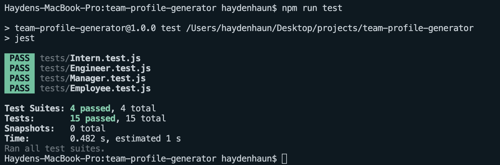

# TEAM PROFILE GENERATOR

LIVE WALKTHROUGH VIDEO:

REPOSITORY: https://github.com/Hayden-Haun/team-profile-generator

## Table of Contents

- [Description](#description)
- [Installation](#installation)
- [Contributions](#contributions)
- [Usage](#usage)
- [Tests](#tests)
- [Technologies Used](#Technologies)
- [Credits](#credits)
- [Questions](#questions)

## Description

    This command lind application prompts the user for information about their team, and displays each member of the team in a neat HTML document. Once information is provided about the manager, the user has the option to add additional employees under two categories: intern & engineer. The user can add as many employees as they want. When the select "DONE", a new index.html file is saved under the /dist folder. Open this to see the output. The viewer of the webpage can click on email links to send a new message to the employee, and they can click on engineer's GitHub name to be directed to their profile. NOTE: all class and subclass tests pass (15 total.... enter npm run test in the command line to see output)

## Installation

    npm i

## Contributions

    Contact the owner

## Usage

    node index.js

## Tests

    npm run rest

## Technologies Used

    Javascript, Test Driven Development, Object Oriented Programming, Node.JS, Bootstrap, HTML, CSS

## Credits

    Hayden Haun

## Questions

    For additional questions, please contact GitHub user Hayden-Haun at haydenhaun@gmail.com
